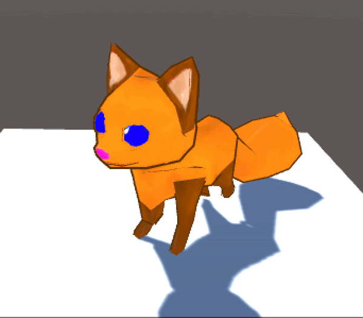

# VR Pets, Status Update 4

Brought to you by the Code Monkeys: Josh Bartling, Elliot Hunt, Kyle Mitchell, and Kurt Risley (RIP Kip DeCastro)

## Last time

- Apartment VR environment, fully furnished (utilities not included)
- Pathfinding and behavior prototyping
- Fox model built, rigged, and animated
- Menu interface organized and constructed

## Since then

- Improved animations
- Swapped in Fox model
- Implemented Fetch action
- "Fixed" controller inputs
- Corrected some menu items
- SO MUCH troubleshooting

### Current Version

{Images, descriptions}

## In progress

With a working MVP, we can continue with features and other plans.

### Current work

Get to a product we can present to our many stockholders and other investors

- Final presentation, with narrative form
- Improve animation timing and triggers
- Adding basic Pet Stats system
- Round out tutorial and interface

### Next steps

Get to a product we can let sit for the summer while we decompress

- Repo tidying, documentation
- Testing and polishing
- Finish courses, graduate (?)

## Future work

Get to a product we can actually put in our portfolios and show to potential employers

- Polish and test more
- Look into publishing
- Watch for AR developments
