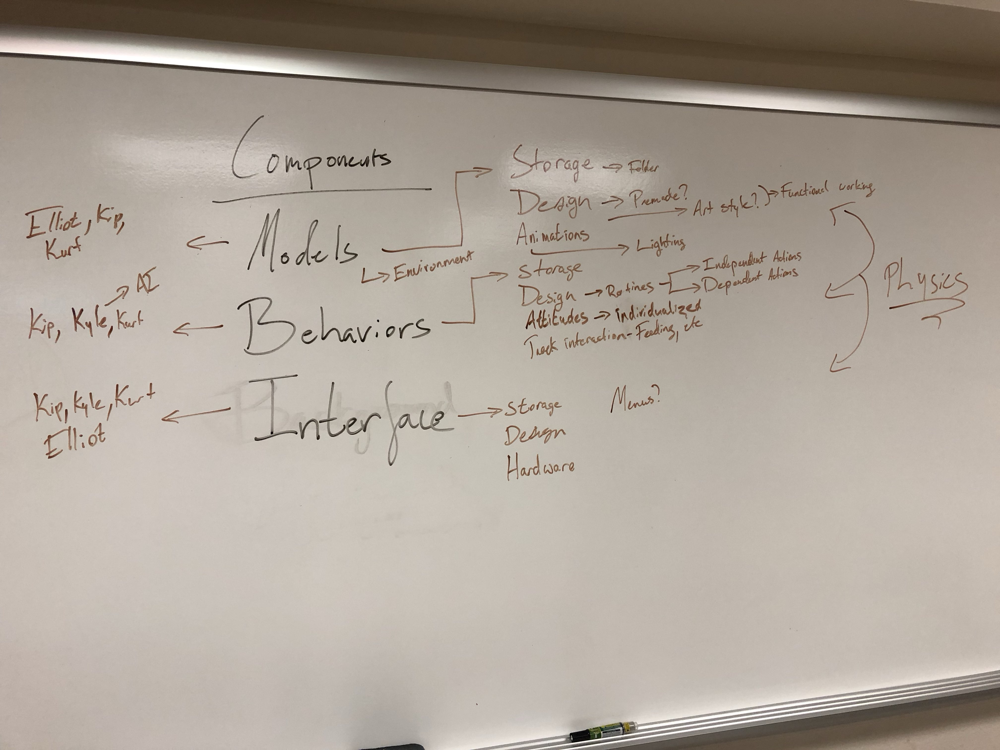
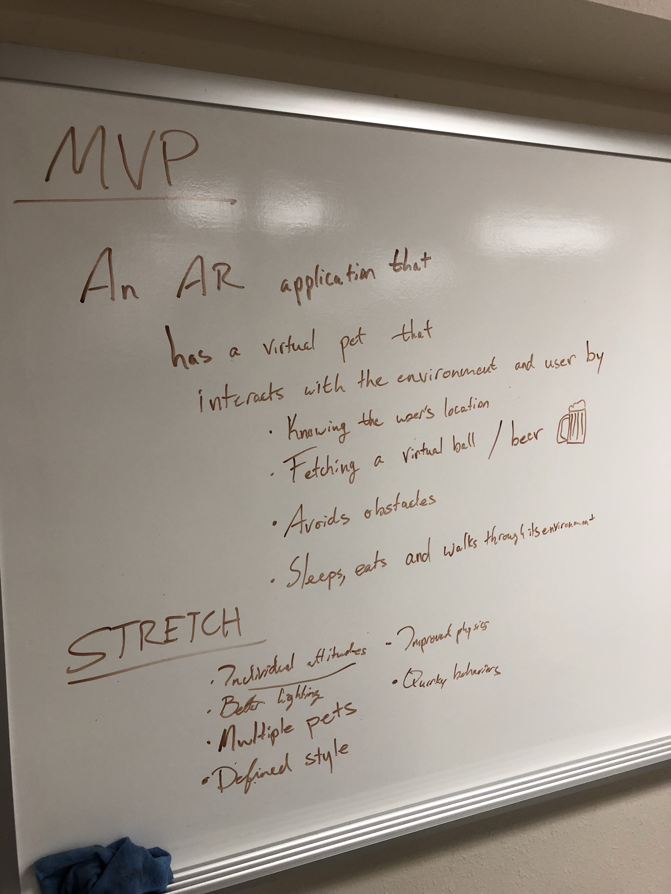

# AR Pets

COSC 4950, Senior Design I

Code Monkeys: Josh Bartling, Kip DeCastro, Elliot Hunt, Kyle Mitchell, Kurt Risley

## General Information

**AR Pets** - An augmented reality game for creating, raising, and caring for virtual pets, directly in your actual environment

### Minimum Viable Product statement

An AR application that has a virtual pet that interacts with the environment and user by knowing the user's location, fetching a thrown virtual ball (or a beer from the AR fridge :beer:), avoiding obstacles,sleeping, eating, and moving through its environment.

### Base Features

- Raise pet through life cycle (rewards and consequences :grave:)
- Feed and play with pet
- Teach pet tricks over time
- Toys/items for pet in environment persist

### Stretch Features/Ideas

- Multiple Pets
- Improved Physics
- Individual attitudes
- Quirky behaviors
- Defined style
- Better lighting

## Technology

- AR Headset - Can be VR-capable, but not VR-only
    - Leap Motion Project Northstar (open source/budget friendly)
    - Microsoft Hololens
    - Magic Leap
- Programming in Unity
- Modelling in Blender

## Project Components

- Models
    - One or more models for a pet
    - Different pets
- Behaviors
    - Personalities
    - Moods
- Interface
    - Application logic
    - Widgets and chrome
- Environment
    - Using external environment
    - Obstacle/item ineraction
